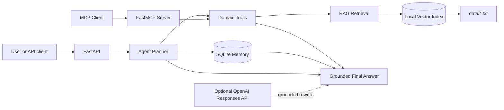

# Architecture

## System view

```text
User / API client
       |
       v
FastAPI (`app/main.py`)
       |
       v
Agent planner (`app/agent.py`)
  |         |             |
  v         v             v
Tools    RAG service   SQLite memory
  |         |             |
  |         v             v
  |    data/*.txt    memory/memory.db
  |    vector_store/protocol_index.json
  |
  +---- same functions <---- MCP/FastMCP server
```

## Mermaid architecture diagram



The live request flow is:

```text
User -> FastAPI -> Agent Planner -> Memory -> RAG -> Tools -> Final Answer
```

Memory and RAG are consulted only when relevant: memory supplies user
preferences, while RAG supplies study facts. Neither is silently substituted
for the other.

## FastAPI layer

`app/main.py` provides typed HTTP contracts for chat, ingestion, memory, tools,
status, and health. It initializes SQLite during application lifespan and
converts application failures into explicit HTTP errors. Swagger UI is
available at `/docs`.

## Agent orchestration layer

`app/agent.py` classifies a request into protocol Q&A, summarization, risk
analysis, action planning, memory, or capability discovery. It then creates a
short plan, invokes the smallest applicable tool sequence, collects sources and
relevant memory, and formats an answer. The public `plan_summary` describes the
workflow without exposing private chain-of-thought.

If `OPENAI_API_KEY` is set, the final grounded tool payload is passed to the
OpenAI Responses API. A failed API call falls back to the deterministic answer;
retrieval, risk rules, and memory do not depend on a paid service.

## Tool layer

`app/tools.py` is the domain boundary. Tools have serializable inputs and
outputs and are used by both the local agent and MCP server. Risk rules require
specific evidence phrases and attach a source, impact, and mitigation. This
makes the demo inspectable instead of hiding all behavior inside one prompt.

## MCP server

`app/mcp_server.py` exposes protocol search, summarization, risk detection,
action planning, and memory over FastMCP's standard tool interface. Run it over
stdio with:

```bash
python -m app.mcp_server
```

An MCP client can launch that command, discover its tools, and invoke them.
For live-demo reliability, the FastAPI app calls the shared Python tool
functions directly; the MCP server exposes those exact same capabilities
through a standardized interface. This avoids network/transport dependency in
the HTTP demo without creating two implementations.

## RAG and vector database

`app/rag.py` reads every `.txt` document, creates overlapping paragraph-aware
chunks, embeds them, and writes vectors plus metadata to
`vector_store/protocol_index.json`. Each chunk records source file, chunk ID,
preview, text, and vector.

At query time, cosine similarity is combined with a small lexical-overlap
signal. This stabilizes exact protocol terms, numbered visits, and
abbreviations while retaining broader vector matching.

The default hashing embedder is deterministic and offline. The optional
`sentence-transformers` backend uses `all-MiniLM-L6-v2` (configurable) for
semantic embeddings. Switching backend requires `POST /ingest` because stored
and query embeddings must use the same representation.

This capstone uses a compact JSON-backed local vector store rather than a
managed database. That is appropriate for the synthetic demo corpus; a
production system should use FAISS, Chroma, or a governed enterprise vector
database.

## SQLite memory

`app/memory.py` creates `memory/memory.db` and the requested `memories` table.
Parameterized SQL supports save, text search, list, and clear operations.
Memory changes response style or context but is never treated as protocol
evidence.

## Docker deployment

The image uses Python 3.11, a non-root user, a health check, and a fixed
application port. Compose mounts data read-only and persists the vector index
and memory database on the host.

## Request sequence

1. FastAPI validates the request.
2. The agent classifies intent and creates a short plan summary.
3. Relevant memory is selected, if enabled.
4. One or more tools retrieve or analyze document evidence.
5. The deterministic formatter creates a grounded answer.
6. If configured, the LLM improves presentation using only the tool payload.
7. The API returns answer, plan, tools, sources, and memory usage.
